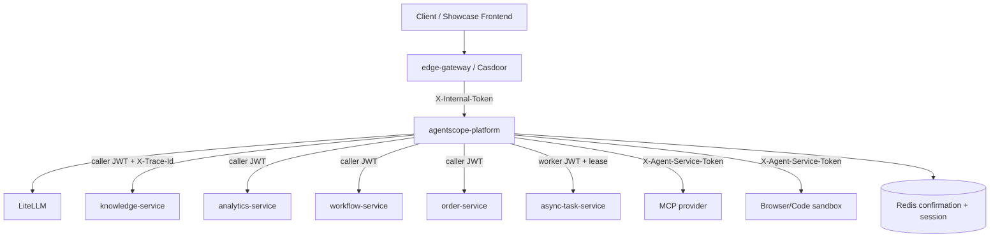
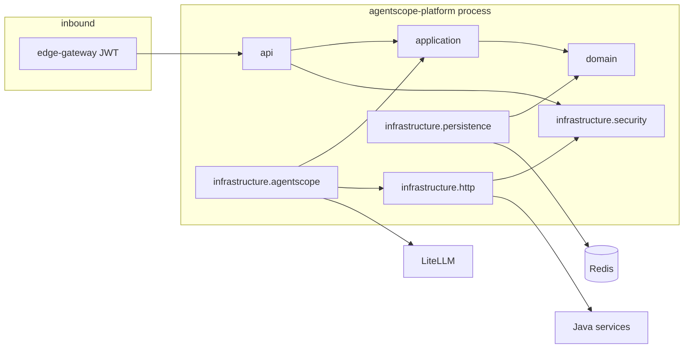

# 架构分析视图
- workspace: `/Users/liruijun/personal/LLM/agentscope-platform`
- generated_at: 2026-09-16
- protocol: project-deep-analysis/v1
- source_of_truth: 源码（README 仅线索）
- re_run_policy: REGENERATE_OWNED_ARTIFACT
- 能力状态标注：已实现 / 可选开关 / 规划中 / 推测

本文件是 `PROJECT_DEEP_ANALYSIS` 的架构切片，**不是**设计阶段的 `BACKEND_ARCHITECTURE`。

---

# 1. Architecture Overview

本系统是企业平台里的 **Agent 编排器**，不是知识库、订单、工作流或任务中心。

调用方经旧平台 `edge-gateway` 换得内部 JWT 后访问本服务。本服务用 AgentScope 2.0 做推理与工具选择，领域副作用一律打回仍在运行的 Java 服务。权威边界：

| 数据/能力 | 权威 Owner | 本服务角色 |
|---|---|---|
| 租户/用户身份 | edge-gateway 签发的内部 JWT | 校验并显式放入 `RunContext` |
| 知识/订单/分析/流程数据 | Java 领域服务 | HTTP 工具，传播 caller token |
| 异步任务状态/SSE 事件 | Java `async-task-service` | 可选 worker + 投影 |
| 写工具确认一次性 | 本服务 Redis/memory replay + JWT grant | 签发与消费 |
| 可恢复会话 checkpoint | 本服务 Redis/memory | CAS + lease |
| 模型调用 | LiteLLM 网关 | fail-once，不在编排层叠加重试 |
| AgentScope Agent/State | 进程内、请求级 | 禁止作为外部存储格式 |



证据：`src/agentscope_platform/api/app.py` 的 `Container` 组装；`docs/architecture.md` 仅作线索，以上边界以代码为准。

# 2. Module Topology

物理上是 **单 Python 包、单进程 FastAPI 服务**。逻辑模块按目录强制分层，并由 `tests/test_architecture_boundaries.py` 锁住。

```text
src/agentscope_platform/
  api/                 FastAPI 路由、JWT 依赖、异常映射、SSE 投影
  application/         用例：run / DAG / planning / sibling / session / async / confirmation
  domain/              语言中立 DTO、工具策略、会话/任务状态、能力注册
  core/                Settings、RunContext ContextVar、deadline ContextVar
  infrastructure/
    agentscope/        唯一允许 import agentscope 的适配器
    http/              Java 客户端、readiness、bulkhead/circuit
    security/          内部 JWT、确认 JWT、downstream JWT、worker JWT
    persistence/       session store memory/redis CAS
    mcp/               Streamable HTTP MCP
    sandbox/           远端 browser/code HTTP
    observability/     structlog、Prometheus、可选 OTel
  evaluation/          Shadow 双跑、数据集、成本 CLI（独立入口，非请求热路径）
```

依赖方向（测试强制）：

```text
api ──▶ application ──▶ domain
 │            ▲
 └──▶ infrastructure ┘
domain 禁止依赖 api / application / infrastructure / evaluation
application 禁止依赖 api / infrastructure / evaluation / agentscope / fastapi / httpx
```

# 3. Layering

## API

- 兼容旧 `/agent/**` JSON 与 SSE。
- 不返回 AgentScope `Msg` / `AgentState`。
- `/health` `/readiness` `/info` 无业务身份；其余路由走 `RunContextDependency`。
- `/agent/v2` 默认不挂载。

## Application

端口在 `application/ports.py`：`AgentRunner`、`DagPlanner`、`AsyncTaskGateway`、`AgentSessionStore` 等。用例服务编排，不感知框架类型。

## Domain

Pydantic/dataclass 契约。关键不变量：

- `ToolMetadata.validate_safety_invariants`
- `AgentSessionCheckpoint.validate_invariants`
- `RunContext.confirmation_for` 必须参数哈希匹配
- MCP `remote_name` 禁止 `platform.agent.*`

## Infrastructure

把端口接到 AgentScope、HTTPX、Redis、JWT。升级 AgentScope 应只改这一层。

# 4. Domain Boundaries

本仓 **没有** 订单/库存/账本聚合。真正的领域对象是编排语义：

- `TenantIdentity` / `RunContext`：一次运行的可信身份与确认集
- `ToolMetadata` / `ToolPolicy`：工具能不能打
- `AgentSessionCheckpoint`：可恢复进度，不是对话产品
- `CentralAsyncTask`：中央任务的投影 DTO
- `DagPlan` / `AgentDagRunReply`：任务图与综合答案
- `ExecutionVersions` / `AgentTrajectory`：可复现评测输入

Java 子域（knowledge / analytics / workflow / order / async-task）通过 ACL（`PlatformClient`）访问，本仓不拥有其表。

# 5. Dependency Relationships



密钥故意拆开：internal JWT、confirmation、downstream、async worker 四套 secret；Settings 在开启对应能力时校验不得复用。

# 6. Data Flow

同步 `/agent/run`：

1. 验签 → 不可变 `RunContext`
2. `bind_run_context` + `bind_deadline`
3. 每次请求新建 AgentScope Agent（或 session 从 checkpoint 恢复）
4. 工具策略 →（写工具）消费 grant → Java/MCP/sandbox
5. 轨迹收集、指标、映射 `AgentRunReply`
6. finally 复位 ContextVar，必要时关闭远端 browser session

异步：本进程 `submit` 后立即 202，任务记录以中央服务为准；本进程持有 lease 才执行。进程 drain 时取消未完成 work。

会话：revision CAS。冲突 → 409。跨租户读不到（伪装 404）。

# 7. External System Dependencies

| 依赖 | 默认 | required for ready? | 凭证 |
|---|---|---|---|
| LiteLLM `GATEWAY_BASE_URL` | localhost:4000 | 是（若 agent_enabled） | `GATEWAY_API_KEY` |
| knowledge 8084 | 开 | 否（降级） | caller JWT |
| analytics 8083 | 开 | 否 | caller JWT |
| workflow 8082 | 开 | 否 | caller JWT |
| order 8093 | 开 | 否 | caller JWT |
| async-task 8086 | **关** | 仅开启后 | worker JWT |
| MCP | **关** | 仅开启后 | downstream JWT |
| Browser/Code sandbox | **关** | 仅开启后 | downstream JWT |
| Redis | session/confirm 默认 memory | 生产写工具/会话强制 | URL |

# 8. Middleware Dependencies

本仓 **没有** MQ、本地 MySQL、Elasticsearch、规则引擎、调度框架。

实际中间件：

- Redis：确认 grant 一次性 `SET NX`；会话 JSON CAS Lua
- Prometheus 指标（`/metrics` 需 JWT）
- OTel：`OTEL_ENABLED=false` 默认关

`redis` 在 `pyproject.toml` 中，且被 session/confirmation 真实调用，不是死依赖。

# 9. Deployment Architecture

- 运行入口：`uvicorn agentscope_platform.main:app` 端口 8085
- Dockerfile：非 root `app` 用户；uv frozen sync；基础镜像钉死 `python:3.12.13-slim-bookworm`
- Compose：只定义 orchestrator；read_only 根文件系统 + `/tmp` tmpfs；`cap_drop: ALL`；`stop_grace_period` 默认 45s 以配合 async drain
- CI：PR/main 跑质量；**仅 tag `v*`** 才 push GHCR、Cosign OIDC 签名、attest
- 本仓 **没有** Helm chart。进度文档中的 HPA/PDB 属于 Java 仓或未纳入本 Workspace，标 UNCONFIRMED

横向扩展含义：

- 默认同步路径无本地权威状态，可多副本
- 若 session/confirmation 用 memory：多副本会丢 lease / 允许确认重放 → 生产校验禁止
- 异步 worker 是 **进程内** 的，容量由 `ASYNC_TASK_MAX_INFLIGHT/CONCURRENT` 限制；任务权威在中央服务，但执行仍粘在抢到 lease 的那个进程

# 10. Architecture Risks

1. **双权威窗口**：Python 确认消费成功后 Java `start_refund` 超时 → 本地 grant 已用、远端 UNKNOWN。本仓不实现对账，依赖 Java `dedupeId`。【Java 去重 UNCONFIRMED】
2. **默认 memory store**：本地 Compose 默认 `AGENT_SESSION_STORE=memory`、`AGENT_CONFIRMATION_REPLAY_STORE=memory`。只有 `app_env=production` 才强制 redis。
3. **DAG 成本放大**：一层并行 workers + synthesis + 默认 replan，同步路径可打出多次模型调用，无独立费用熔断（只有 token/time budget per run）。
4. **Process 规划靠中文/英文标记**：模型换一种“帮我批了”的说法可能逃过描述过滤，最终仍应被工具策略拒绝；过滤是纵深防御而非唯一门。
5. **ContextVar**：AgentScope 若把工具丢到无 context 的线程，会直接 `RuntimeError` 或串请求。当前假设是 asyncio 同任务传播。
6. **生产切流未完成**：代码自称 Phase 5 全量默认切换，但发布证据默认 NO-GO。宣传“已切生产”会与门禁冲突。
7. **Java 租户隔离**：Python RAG 只在 Java 返回 `tenant_id` 时二次校验；若 Java 漏字段，校验跳过。证据：`if reply.tenant_id and reply.tenant_id != ...`
8. **无本仓限流**：容量保护在 edge / LiteLLM / Java；编排器只有连接池、bulkhead、async inflight。
