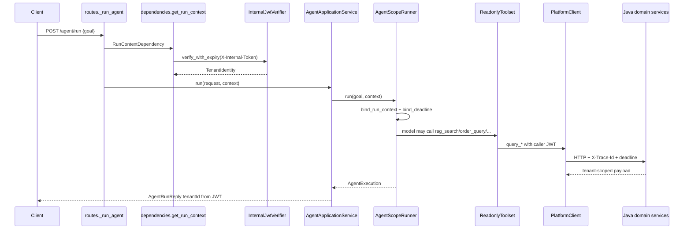
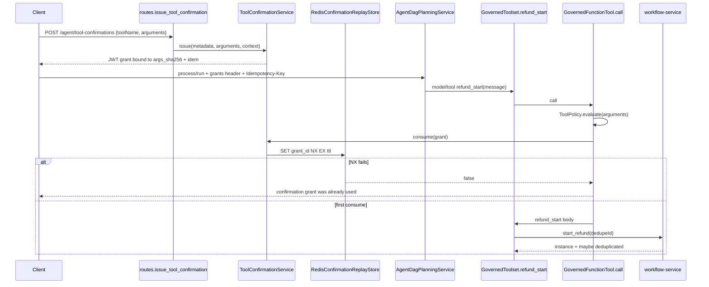
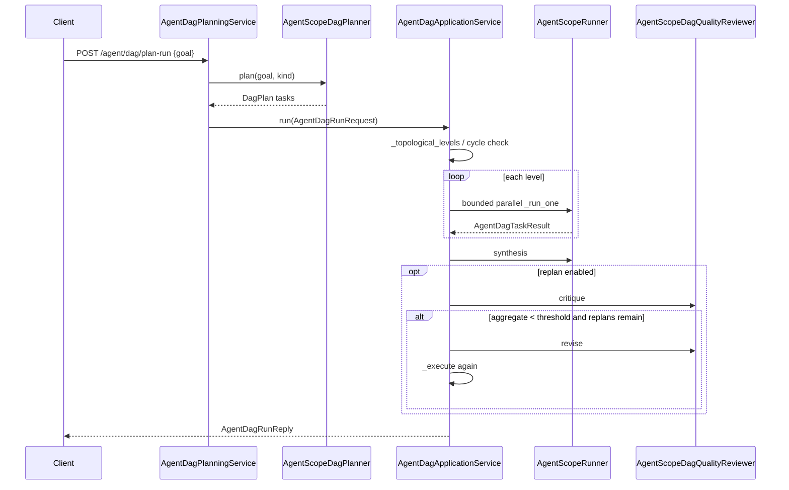
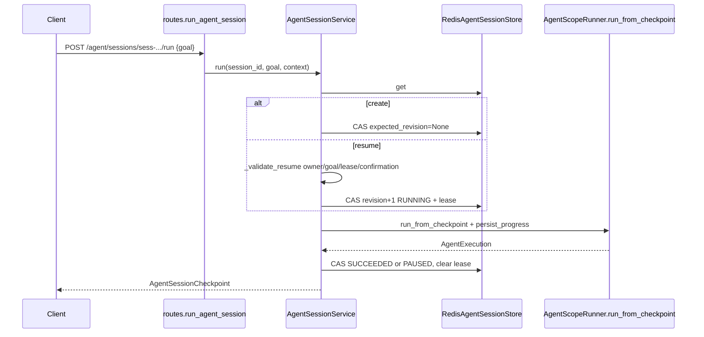
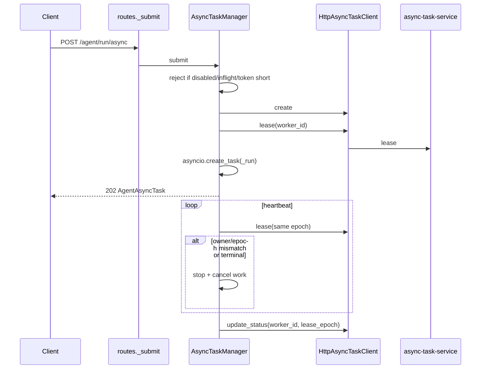

# 核心业务链路
- workspace: `/Users/liruijun/personal/LLM/agentscope-platform`
- generated_at: 2026-09-16
- protocol: project-deep-analysis/v1
- source_of_truth: 源码（README 仅线索）
- re_run_policy: REGENERATE_OWNED_ARTIFACT
- 能力状态标注：已实现 / 可选开关 / 规划中 / 推测

识别 8 条主链路。缺失层写 `N/A`。类名/方法名来自源码。

---

# Flow 1 同步只读 Agent 问答 `/agent/run`

- 业务目标：用当前租户身份回答 goal，必要时调用只读 Java 工具，返回兼容 JSON。
- 入口：`POST /agent/run`
- Controller：`src/agentscope_platform/api/routes.py` `run_agent` → `_run_agent`
- Application Service：`AgentApplicationService.run`
- Domain Service：`ToolPolicy.evaluate`（只读工具几乎总是 ALLOW，缺 scope 除外）
- Repository：N/A
- Database：N/A
- Cache：N/A
- MQ：N/A
- Third-party Service：LiteLLM；可选 knowledge/analytics/order/workflow
- 状态变化：无持久单据；响应 `stopReason` ∈ DONE/MAX_STEPS/LOOP/TIMEOUT/BUDGET/CANCELLED/ERROR
- 事务边界：无本地 DB 事务；每次请求独立 Agent
- 异常路径：未配置网关 503；JWT 失败 401；工具失败进入 observation，不伪造成功
- 幂等机制：只读，无 Idempotency-Key 要求
- 一致性策略：身份以 JWT 为准；RAG 若返回 tenant_id 则二次核对
- 最终结果：`AgentRunReply` + 版本响应头
- 可信度：CONFIRMED
- 能力状态：已实现



---

# Flow 2 受治理退款发起 `refund_start`

- 业务目标：在人明确确认后，仅 **发起** Java 退款审批流程，绝不自动批准。
- 入口：`POST /agent/tool-confirmations` 然后带 grant 的 `/agent/process/run` 或普通 run（工具需已注册）
- Controller：`issue_tool_confirmation`；后续 `run_process` 或 `run_agent`
- Application Service：`ToolConfirmationService.issue/verify_tokens/consume`；`AgentDagPlanningService.plan_and_run`
- Domain Service：`ToolPolicy` + `canonical_tool_arguments_hash`
- Repository：`ConfirmationReplayStore.consume`
- Database：N/A（本仓）；Java workflow 为写权威
- Cache：Redis `SET NX` 记 grant_id，不是业务账本
- MQ：N/A
- Third-party Service：`POST {WORKFLOW_BASE_URL}/workflow/refund/start`
- 状态变化：Java 实例 WAITING_APPROVAL；Python 无流程状态机
- 事务边界：确认消费与 Java 调用 **不是** 同一本地事务
- 异常路径：缺 scope 403；缺幂等键拒绝签发；grant 重放 DENY；Java 失败映射为工具 ERROR
- 幂等机制：请求头 `Idempotency-Key` → `dedupeId`；Java 若返回 `deduplicated=true` 则提示未重复发起
- 一致性策略：最弱足够 = 一次性 grant + 下游业务键；超时 UNKNOWN 依赖 Java 去重【Java 唯一约束 UNCONFIRMED】
- 最终结果：工具 observation 含 instanceId/status，并声明尚未批准
- 可信度：CONFIRMED（Python 侧）；PARTIAL（端到端账本）
- 能力状态：可选开关 `AGENT_REFUND_START_ENABLED=false`



失败链路：

```text
正常路径：签发参数绑定 grant → 消费 NX → Java start
失败点：Java 在 NX 成功后超时
如果普通 CRUD：会重试导致双开流程
当前设计如何挡住：retryPolicy=NONE；grant 一次性；把同一 Idempotency-Key 交给 Java
还可能在哪里破：Java 未对 dedupeId 做唯一约束；memory replay 多副本；grant 过期后换新 grant 但同 key 的语义依赖 Java
```

---

# Flow 3 DAG 同步编排 `/agent/dag/run` 与 plan-run/analyst

- 业务目标：把 goal 拆成有依赖的子任务，同层有界并行，综合答案；可选 critic 低于阈值则有限次重规划。
- 入口：`POST /agent/dag/run`、`/agent/dag/plan-run`、`/agent/analyst/run`
- Controller：`run_agent_dag`、`plan_and_run_agent_dag`、`run_analyst_agent`
- Application Service：`AgentDagApplicationService.run`；`AgentDagPlanningService.plan_and_run`
- Domain Service：N/A（拓扑在 application）
- Repository：N/A
- Database：N/A
- Cache：N/A
- MQ：N/A
- Third-party Service：Planner/Reviewer/每个 worker 都走模型网关；worker 内仍可打只读工具
- 状态变化：响应含 `levels`、`taskResults`、`attempts`、`acceptedByThreshold`
- 事务边界：无；失败取消同层 pending tasks
- 异常路径：空 goal/环/超任务数 400；critic 失败 502
- 幂等机制：无（同步只读为主）
- 一致性策略：每个 worker 共用同一 `RunContext`，新建独立 Agent
- 最终结果：`AgentDagRunReply`
- 可信度：CONFIRMED
- 能力状态：已实现；replan 默认开



---

# Flow 4 Process 只读/受控写 `/agent/process/run`

- 业务目标：处理流程诉求；默认只查询实例和待办。写操作仅 `refund_start` 且需确认。
- 入口：`POST /agent/process/run`
- Controller：`run_process`
- Application Service：`process_planning_service`（独立 DAG 服务：max_tasks≤4，replan 关）
- Domain Service：规划层标记过滤 + `ToolPolicy`
- Repository：N/A
- Database：N/A
- Cache：N/A
- MQ：N/A
- Third-party Service：workflow_status/tasks；条件退款 start
- 状态变化：同 DAG reply
- 事务边界：无
- 异常路径：Planner 提出审批/认领等描述 → 丢弃计划，回退只读单任务
- 幂等机制：写路径同 Flow 2
- 一致性策略：fail-closed 回退只读，而不是执行非法计划
- 最终结果：只读答案或已发起待审批流程
- 可信度：CONFIRMED
- 能力状态：已实现；写为可选开关

---

# Flow 5 可恢复会话 `/agent/sessions/{sessionId}/run`

- 业务目标：跨请求恢复 Agent 进度，不把框架 state 或 caller token 写入存储。
- 入口：`POST /agent/sessions/{sessionId}/run`（sessionId `^sess-[a-f0-9]{32}$`）；`GET` 读 checkpoint
- Controller：`run_agent_session`、`get_agent_session`
- Application Service：`AgentSessionService.run/get`
- Domain Service：checkpoint 不变量（副作用必须带幂等摘要；lease 成对出现）
- Repository：`AgentSessionStore.compare_and_set`
- Database：N/A
- Cache：Redis key `{namespace}:{sessionId}` JSON + EX ttl；或进程内 dict
- MQ：N/A
- Third-party Service：同 Flow 1 的工具
- 状态变化：READY/RUNNING/PAUSED/SUCCEEDED/FAILED/CANCELLED；DONE→SUCCEEDED，否则 PAUSED
- 事务边界：每次进度一次 CAS；丢 lease → 409
- 异常路径：跨租户 404；goal 哈希不符 409；RUNNING 且 lease 未过期 409；副作用恢复缺新确认 412
- 幂等机制：副作用 checkpoint 绑定 `idempotencyKeySha256`
- 一致性策略：revision 乐观并发 + lease 互斥；多副本必须 redis
- 最终结果：语言中立 `AgentSessionCheckpoint`
- 可信度：CONFIRMED
- 能力状态：已实现；默认 memory，生产强制 redis



---

# Flow 6 异步编排 202 + 可恢复 SSE

- 业务目标：把长任务交给中央任务服务，查询/取消/SSE 与旧客户端兼容。
- 入口：`POST /agent/run/async` 等；`GET /agent/tasks/{id}/stream?lastEventId=`
- Controller：`_submit`、`stream_agent_task`、`cancel_agent_task`
- Application Service：`AsyncTaskManager.submit/get/cancel/shutdown`
- Domain Service：`AgentAsyncTask.from_central` 投影；过滤非 agent kind
- Repository：N/A（权威 HTTP 到 async-task-service）
- Database：N/A
- Cache：N/A
- MQ：N/A（中央服务内部实现 UNCONFIRMED）
- Third-party Service：`HttpAsyncTaskClient`
- 状态变化：PENDING/RUNNING/SUCCEEDED/FAILED/CANCELLED
- 事务边界：create 后 lease 失败则 cancel；完成带 worker_id+lease_epoch
- 异常路径：开关关或容量满 503；token 剩余寿命不足拒绝提交；心跳丢失 epoch 则停
- 幂等机制：进度事件 `eventKey = worker:epoch:counter:event`
- 一致性策略：lease fencing；本进程不是任务存储
- 最终结果：202 `AgentAsyncTask`；SSE 经 `redact_pii`
- 可信度：CONFIRMED
- 能力状态：可选开关，默认关



---

# Flow 7 Sibling：chain / vote / reflexion

- 业务目标：兼容旧平台的提示链、投票、反思，不走工具集。
- 入口：`POST /agent/chain`、`/agent/vote`、`/agent/reflexive`、`/agent/reflexive/stream`
- Controller：对应 routes
- Application Service：`PromptChainService`、`VotingService`、`ReflexionService`
- Domain Service：N/A
- Repository：N/A
- Database：N/A
- Cache：N/A
- MQ：N/A
- Third-party Service：`AgentScopeTextGenerator` → LiteLLM
- 状态变化：无持久状态
- 事务边界：无
- 异常路径：空输入 400；生成失败 502；流式队列满时取消 producer 避免死锁
- 幂等机制：无
- 一致性策略：步骤/候选上限来自 Settings；voting 有界并行
- 最终结果：兼容 JSON 或 SSE
- 可信度：CONFIRMED
- 能力状态：已实现

---

# Flow 8 能力发现与版本化注册表

- 业务目标：给 Java interop 提供稳定能力清单；旧接口只返回前 4 项以保持兼容。
- 入口：`GET /agent/capabilities`、`GET /agent/capabilities/registry`
- Controller：`agent_capabilities`、`agent_capability_registry`
- Application Service：N/A（纯 domain 函数）
- Domain Service：`capability_registry()`
- Repository：N/A
- Database：N/A
- Cache：N/A（ETag = revision sha256）
- MQ：N/A
- Third-party Service：N/A
- 状态变化：无
- 事务边界：无
- 异常路径：仍要 JWT
- 幂等机制：GET
- 一致性策略：内容寻址 revision
- 最终结果：旧 list 或 `AgentCapabilityRegistry`
- 可信度：CONFIRMED
- 能力状态：已实现
